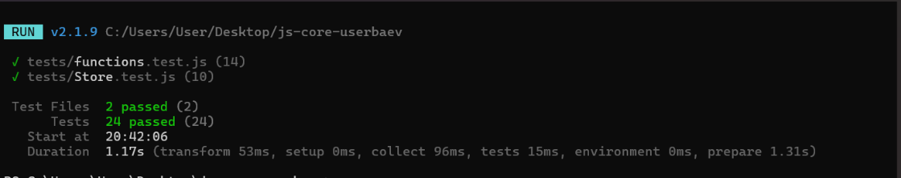

# js-core-userbaev

Lab 4 — pure JavaScript: higher-order functions, closures, classes, unit tests.

## How to run the tests

```bash
npm i
npm test
```

Requires Node.js LTS (`node -v`, `npm -v` before you start).

## Structure

```
src/functions.js — unique, groupBy, chunk, deepClone, memoize, counter
src/Store.js — Store and SortedStore classes
tests/ — Vitest tests
```


## Closures in my code

Closures are used in two functions. `memoize(fn)` creates a `cache` variable
(a Map) once when called, and the returned inner function remembers this
variable between calls — so the cache is not lost and is not directly
visible from outside. `counter(start)` works similarly: the `value`
variable "lives" inside the closure, and the `inc`, `dec`, `value` methods
are the only way to change or read it. Each call to `counter()` creates a
new, independent `value` variable, so two counters do not interfere with
each other. The closure works because JavaScript does not delete the outer
function's variables while a reference to them still exists from the inner
function — the engine keeps them in memory even after the outer function
has already finished running.

## Screenshot of passing tests



## AI tools

Used Claude (Anthropic) to write part of the code and tests. Before
submitting, I went through the implementation of every function and class
so I can explain it myself.
